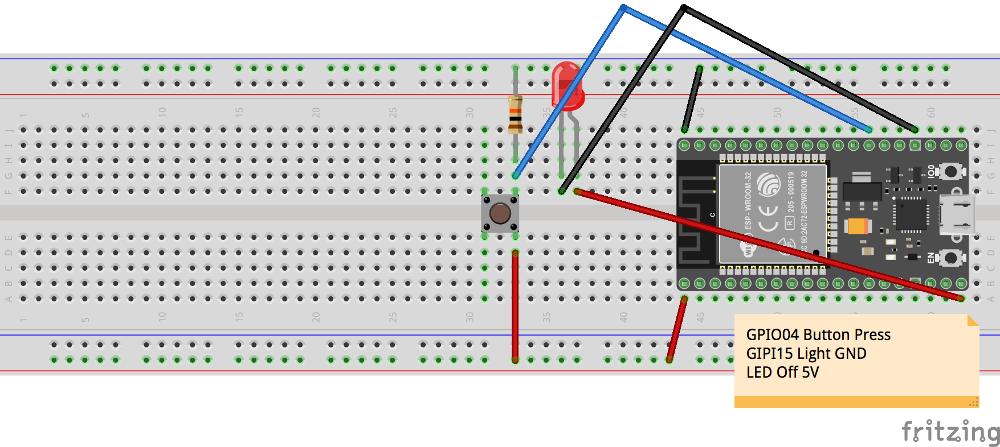

# BossButtons

Slapa'da button to start a timer (or do something). Slapa'da button to stop a timer (or something)

# About

Does finding that Boss task have you down?  Well don't fret BossButtons is gonna help you out.  BossButtons is a bank of 8
arcade buttons they you assign to a #Task.  Slapa'da button to start your timer, slapa'da button to stop it.

# References

* [Button Tutorial](https://www.arduino.cc/en/Tutorial/Button)

# Prototype

This circuit works for single button using BossButtons.ino sketch sends HTTP request to hard coded URL

# Hardware

## Controller

[Node MCU ESP-32S](https://www.amazon.com/gp/product/B0718T232Z/ref=oh_aui_detailpage_o03_s02?ie=UTF8&psc=1)

## Power

Power will be through USB 5VUSB cord for power

## Misc Parts

Will need various resistors, boards, solder, etc..

## Enclosure

Will use FreeCAD or Fusion360 to design a box

## Buttons

Starting with [these](https://www.amazon.com/gp/product/B00XJ8UEQ0/ref=oh_aui_detailpage_o03_s00?ie=UTF8&psc=1) but
they are 5v so driving with 3.3v GPIO is tricky

Adafruit has some nice [3.3v buttons](https://www.adafruit.com/product/3487) that fade

# Communication

Communication will be via HTTP request to whatever URL you code in.  ?button=X will be sent when a button is pressed

# Application

On the application side can configure however you want. One button to start, one to stop, same button for start/stop.

