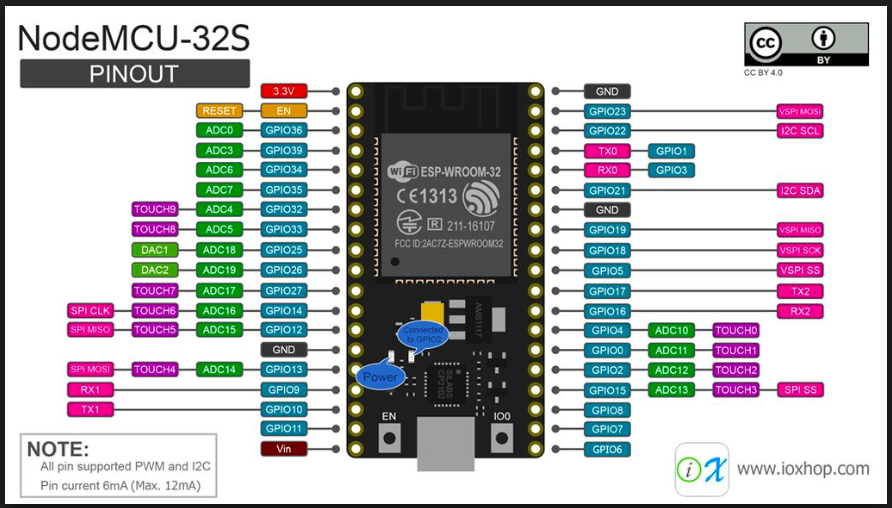

# BossButtons

Slapa'da button to start a timer (or do something). Slapa'da button to stop a timer (or something)

# About

Does finding that Boss task have you down?  Well don't fret BossButtons is gonna help you out.  BossButtons is a bank of 8
arcade buttons they you assign to a #Task.  Slapa'da button to start your timer, slapa'da button to stop it.

# References

* [Button Tutorial](https://www.arduino.cc/en/Tutorial/Button)

# Hardware

* Arduino with wireless module or ESP32

* USB cord for power
* Various resistors / prototype boards
* 3D printed enclosure

* Some [arcade buttons](https://www.amazon.com/gp/product/B00XJ8UEQ0/ref=oh_aui_detailpage_o03_s00?ie=UTF8&psc=1)

# Communication

Communication will be via HTTP request to whatever URL you code in.  ?button=X will be sent when a button is pressed

# Application

On the application side can configure however you want. One button to start, one to stop, same button for start/stop.

